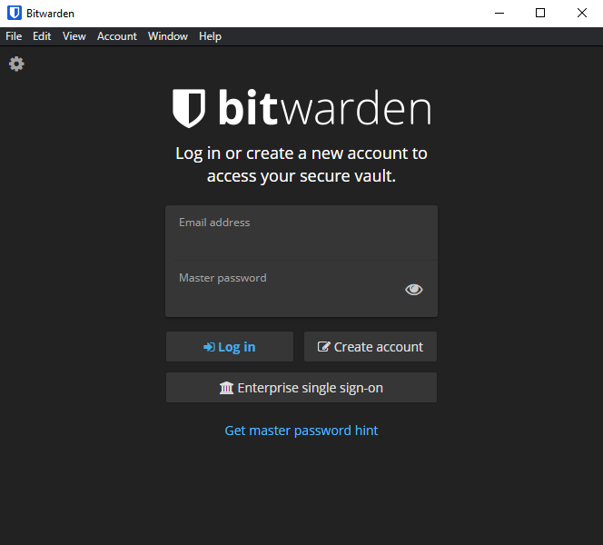
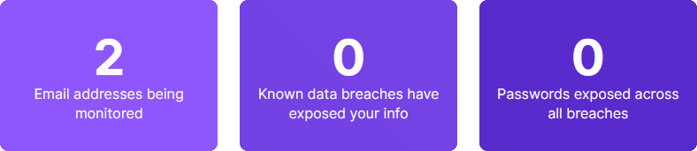

# Security

This document goes over the global lines of protecting you, your accounts and your data. Not all steps are required, but recommended.

## Passwords and accounts

One of the most important things to do is to ensure that all accounts are safe. This can simply be done by making your passwords very difficult to crack. But then you must remember all of them. That's what a password manager if for. It automatically fills everything in for you. 2 factor authentication is also an important step towards safety.

### Password Manager [](https://bitwarden.com/)

There are many options for password managers. And also with many different prizes. Some are also free. One of them is Bitwarden. This password manager is open-source and has a free plan. If you run the code yourself you even get the premium features for free, but they are not really necessary for a normal user.

Because the data is encrypted on your own device, even Bitwarden doesn't know the passwords. **So never lose your password, because the support team can not get it back, nor your passwords stored.**



### 2FA - 2 Factor Authentication [](https://authy.com/)

2FA is a technology that takes security to the next level. When you normally log in with only a password, you must now also fill in a number code. This code changes every 30 seconds. As a result, your account is safer and less likely to be hacked.

Authy is a program where you can save these codes. If a service or website supports 2FA, you will be asked for an authentication app. Usually Google authenticator is recommended, but Authy is not from Google, and therefore has my preference.

If you use 2FA, always take your phone with you. **You can't get into your account without 2FA if it's turned on. The only way is with backup codes. Do not lose those.** 2FA can be turned off again.

*2FA can also be in the app of Bitwarden, but still needs an authentication app for the 2FA of the program itself. It is also a paid feature and not included in the free plan.*


### Monitors on data breach [](https://monitor.firefox.com/)

There are regularly services that are hacked and where the data is sold on the black market. With a monitor service you can keep an eye on whether your data has been taken with a data breach or hack. With FireFox Monitor you can enter emails that need to be scanned for data breaches. The service will keep you up to date if something happens to your data and will send an email.



## Online

It is very important to use the correct browser and search engine. that way, your data is safer.

### Firefox ([Link](https://www.mozilla.org/en-us/firefox/new/))

Firefox is one of Chrome's largest opponents. But where Chrome is from Google, Firefox is made by Mozilla. This is a non-profit organization with the user on the number one spot. They have built Firefox from the ground up. So it is possible that things don't work nicely. But that happens the other way around, because most websites are made using Firefox for testing.

#### Firefox Settings

There are things that need to be adjusted.
First is the default search engine. As explained in [this](#search-engine) section, Google isn't the best search engine to use. First, set that to DuckDuckGo in the dropdown menu. Along with that, turn off search suggestions. This is a personal preference, but will make the amount of data send to the server less. These settings can be changed here:

```txt
about:preferences#search
```


Then, you also want to make the tracking protection stronger. You also want to always send websites the `Do Not Track` attribute. That way, less data is collected through websites. Next, if you're going to use a password manager, as explained [here](#password-manager-bitwarden), turn off password autofill. You can also disable suggestions from history a bit lower down. You also want to block popups and warn be warned when extensions are installed. Last, disable telemetry. These settings can be changed here:

```txt
about:preferences#privacy
```


Last, you can either enable Firefox to delete all browsing data and cookies, or only delete the history. The first logs you out of all your sessions each time the browser closes. The later, my preferred choice in combination with some cookie container [extensions](#firefox-extensions), is enabled the following.


#### Firefox extensions

These extensions are my recommend extensions that i use with Firefox. They block requests that can track you around the web. Keep in mind that the cookie extensions can break websites when they're enabled.

`General`

- [Link](https://addons.mozilla.org/en-us/firefox/addon/duckduckgo-for-firefox/) - DuckDuckGo Privacy Essentials
- [Link](https://addons.mozilla.org/en-us/firefox/addon/ublock-origin) - uBlock Origin
- [Link](https://addons.mozilla.org/en-us/firefox/addon/privacy-badger17/) - Privacy Badger
- [Link](https://addons.mozilla.org/en-us/firefox/addon/https-everywhere) - HTTPS Everywhere
- [Link](https://addons.mozilla.org/en-US/firefox/addon/i-dont-care-about-cookies) - I don't care about cookies
- [Link](https://addons.mozilla.org/en-us/firefox/addon/bitwarden-password-manager/) - Bitwarden

`Cookie`

- [Link](https://addons.mozilla.org/en-US/firefox/addon/facebook-container-newalexndra) - Facebook Container Extended
- [Link](https://addons.mozilla.org/en-us/firefox/addon/firefox-google-container/) - Google Container 2021
- [Link](https://addons.mozilla.org/en-us/firefox/addon/microsoft-container) - Microsoft Container

### Brave ([Link](https://brave.com/))

Brave is another good alternative. Where Firefox was built off the ground, Brave is built on open-source chromium. That is the basis of Chrome and many other browsers. But Brave removed anything to do with Google. As a result, it works the same as Chrome, but it is better behind the scenes.

#### Brave settings

Almost all Brave's settings are good out of the box. The only thing that is not good is their own crypto currency. You can earn this by viewing ads. However, this is not realistic with how little money you get. There are some settings that need to be changed to completely disable this:

```txt
TODO: This section will be filled in later
```

#### Brave extensions

`General`

- [Link](https://chrome.google.com/webstore/detail/duckduckgo-privacy-essent/bkdgflCldnnApblkhphbgPGGdiikPpg) - DuckDuckGo Privacy Essentials
- [Link](https://chrome.google.com/webstore/detail/ublock-origin/cjpalhdlnbpaMameJdnhcphJbkeiaGm) - uBlock Origin
- [Link](https://chrome.google.com/webstore/detail/privacy-badger/pkehgijcmpdhfbdbbnkijodmdjhbjlgp) - Privacy Badger
- [Link](https://chrome.google.com/webstore/detail/https-everywhere/gcbommkclmclpchllfjekcdonpmejbdp) - HTTPS Everyhere
- [Link](https://chrome.google.com/webstore/detail/bitwarden-free-password-m/nngceckbapebfimnlniiahkandclbb) - Bitwarden

### Search engine

Google as a search engine has its advantages. The user interface is nice to work with and there are many nice to have things, like movie information and Wikipedia summaries that are displayed directly. But the search results are all adapted to you, through tracking. Every letter that you type goes to Google. And in some cases the search results are also filtered to what the government wants it to be.

[DuckDuckGo](https://duckduckgo.com/about) is an alternative search engine that doesn't track you. The results are also not filtered. You will also have the standard things, such as suggestions during typing and information that is displayed directly, such as Wikipedia.

You also have "[Bangs](https://duckduckgo.com/bang)". These are short sets from characters that you put in front of your search. If you want to find something on Wikipedia directly, then type `!w DuckDuckGo` to search for DuckDuckGo on Wikipedia.

## IDFA (identifier for advertisers)

On phones there is something like an IDFA. Almost all apps use that to send your data to a server. With that number that data is linked to you. You can reset this how often you want. You also have to turn the personalization of ads. This can be done like this:

```txt
TODO: This section will be filled in later
```

```txt
This section will be expanded as soon as this can be turned off.
```

## Windows settings

Not only the browser must be protected. The Windows installation itself must also. These are a few things that you can already do by default.

```txt
TODO: This section will be filled in later
```

### Normal settings

Windows automatically sends data from your computer to Microsoft. These settings are on, but can also be turned off. Also, Windows uses your bandwidth to install updates on other Windows computers. As a result, your internet is slow. You can also disable this.

### Bloatware

Windows comes with many programs that you don't need. With [PyDebloatX](https://pydebloattx.com/) you can easily find all the programs that you do not want to remove them, but also find them back in the Microsoft Store. In addition, [Windows10debloater](https://github.com/sycnex/windows10debloater) is a very good tool for removing things that are deeper integrated into Windows, such as Cortana, Edge PDF and Telemetry.

```txt
TODO: This section will be filled in later
```

### Microsoft Edge

Although you may have another browser installed, Windows still opens Edge in some cases. And you cannot change that in the settings.

But there is a program for that. [EdgeDeflector](https://github.com/da2x/edgedeflector) is a tool that tells Windows that it is equal to Edge. You must then choose whether to open your Edge or EdgeDeflector. When you open EdgeDeflector, it will open the default browser you set. It will only ask once to choose, so don't worry about the popup.

In combination with the Firefox extension [Bing to DuckDuckGo](https://addons.mozilla.org/en-us/firefox/addon/bingtoduckduckgo) you can make sure all searches go through DuckDuckGo, which is better to use as explained [here](#search-engine). DuckDuckGo "Bangs" also work here too!
