# Security Notes - Dummy Guide

## Brave Settings

<p align="center"></p>

### General settings

First, let's tackle the home screen. There you want to disable the cards for various crypto currencies. That can be done by clicking the `Customize` button to the bottom right. From there, under `Cards`, click `Hide` underneath all the cards.

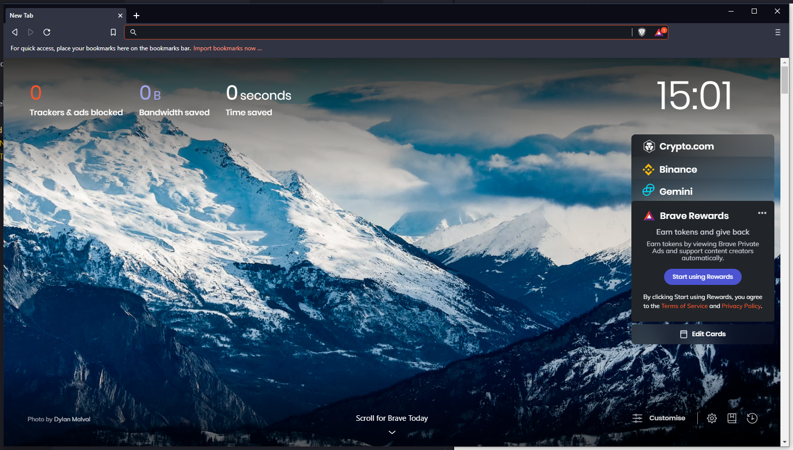

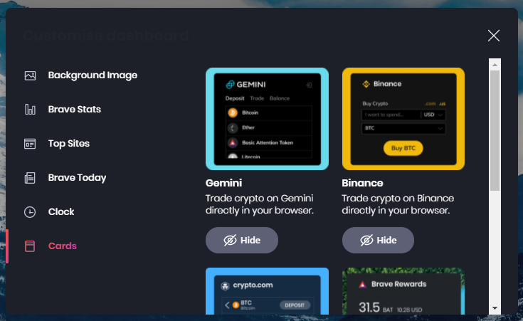

Next, we will hide the Brave Rewards button. Just enable the setting to hide the Brave Rewards button. It can be found here:

```txt
brave://settings/appearance
```

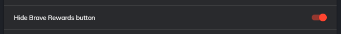

Then you want to set both `Trackers & ads blocking` and `Fingerprinting blocking` to aggressive and strict respectively. **This can cause sites to break.** These settings can be found here:

```txt
brave://settings/shields
```

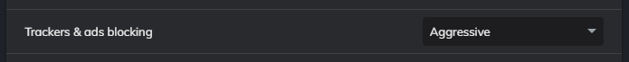

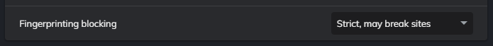

After that, change your default search engine to DuckDuckGo, as explained [here](../README.md#the-better-alternative-duckduckgo). This can be changed here:

```txt
brave://settings/search
```

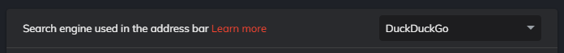

Next, you want to select that to delete when you close Brave. These can be site-settings, cookies, etc. They can be found here:

```txt
brave://settings/privacy
```

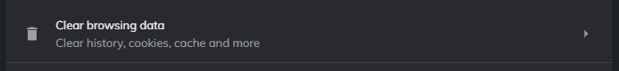

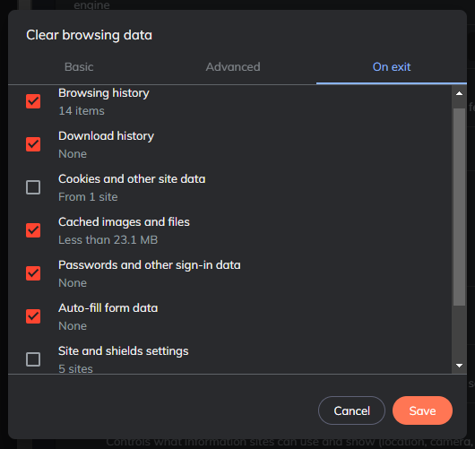

If you're going to use a password manager, as explained [here](../README.md#password-manager-bitwarden), turn off autofill for passwords, payment methods, and addresses. There is a toggle on each page to turn it off

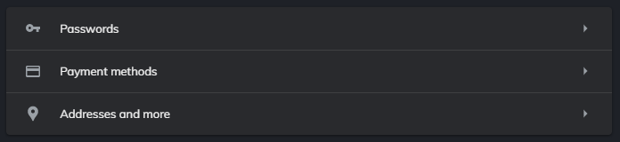

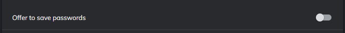

### Brave Rewards

Even if you never enable Brave Rewards, there will still be `Tip` buttons on some websites that enable them. These can be turned off in the Rewards section of the settings. First, click `Start using Brave Rewards`. You can skip the tour. Click the toggle for `Ads` and `Auto-Contribute` to turn them off. Last, at the bottom in the section for Tips, click the options button and disable all sites that are enabled.

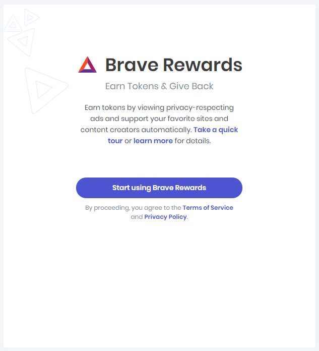

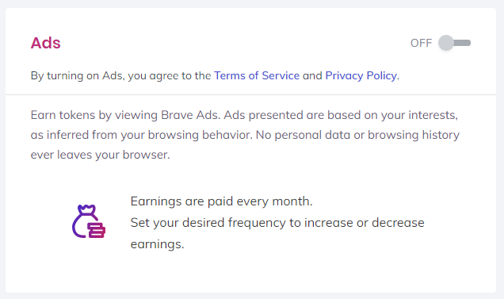

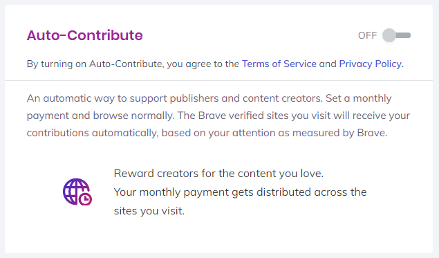

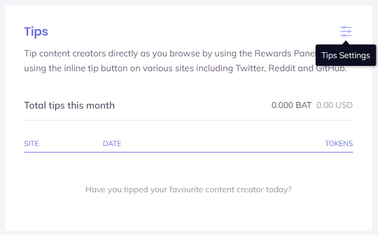

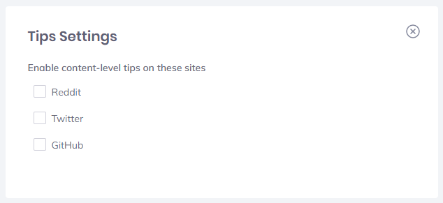

And that's it!

---

[Go back](../README.md) or [continue where you left off](../README.md#2nd-browser-of-choice-brave)
