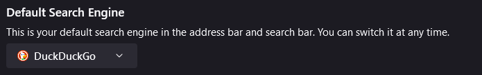
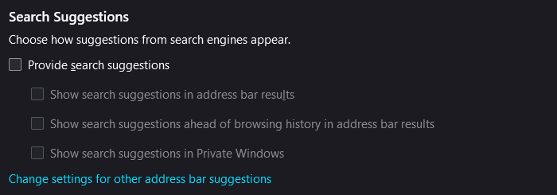
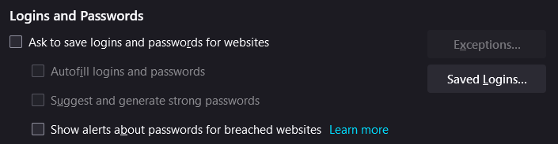
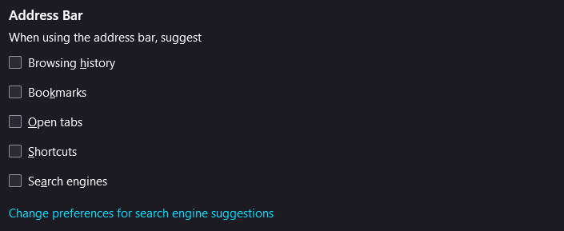
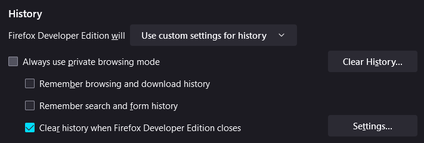

# Security Notes - Dummy Guide

## Firefox Settings

First, set that to DuckDuckGo in the dropdown menu. Along with that, turn off search suggestions. This is a personal preference, but will make the amount of data send to the server less. These settings can be changed here:

```txt
about:preferences#search
```





Then, you also want to make the tracking protection stronger. You also want to always send websites the `Do Not Track` attribute. That way, less data is collected through websites. Next, if you're going to use a password manager, as explained [here](../README.md#password-manager-bitwarden), turn off password autofill. You can also disable suggestions from history a bit lower down. You also want to block popups and warn be warned when extensions are installed. Last, disable telemetry. These settings can be changed here:

```txt
about:preferences#privacy
```







Last, you can either enable Firefox to delete all browsing data and cookies, or only delete the history. The first logs you out of all your sessions each time the browser closes. The later, my preferred choice in combination with some cookie container [extensions](../README.md#firefox-extensions), is enabled the following.



[Go back to the main document](../README.md)
