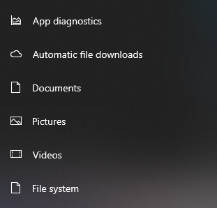

# Security Notes - Dummy Guide

## Windows Settings

### Update & Security

In the section for `Update & Security`, there is a tab for `Delivery optimalisation`. In there, you can toggle off that your computer will be used to download Windows updates to other computers on your network.

### Privacy

There are also many settings all apps have access too, like location and history of your account. You can turn those off under the `Privacy` section in the settings app. Below i've listed the categories which should all be turn off or sending as little information as possible.

---

[Go back](../README.md) or [continue where you left off](../README.md#settings-menu)
